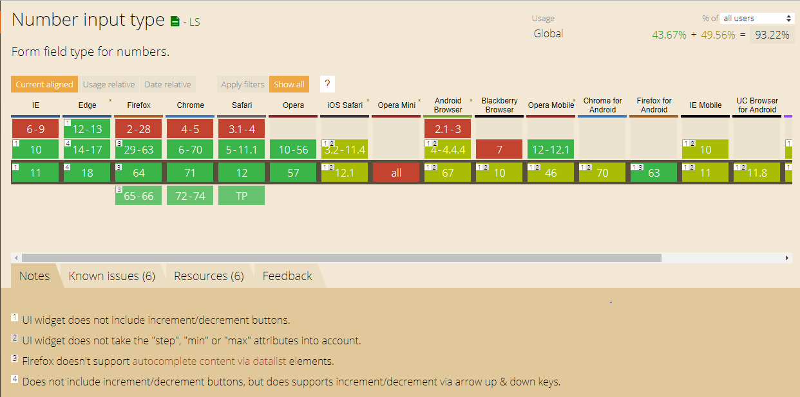
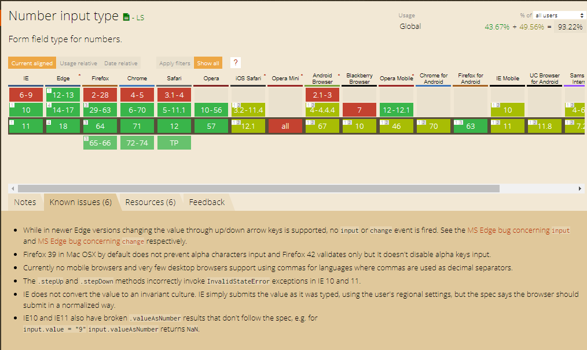
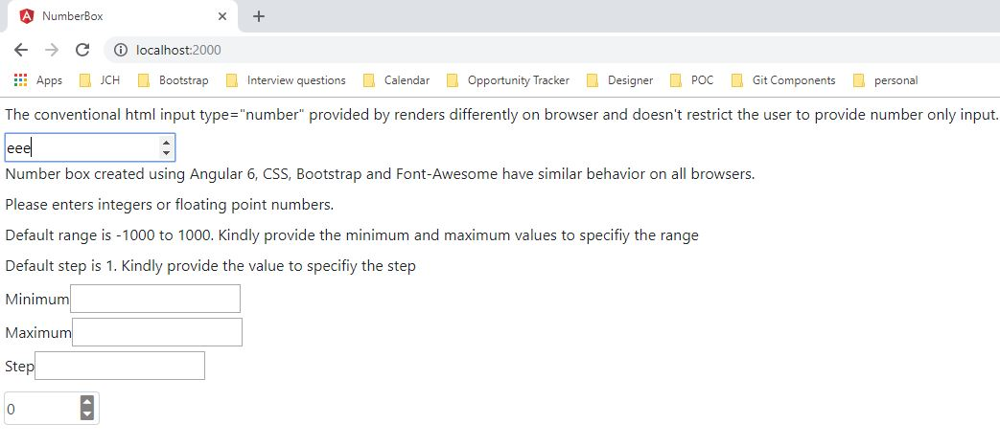
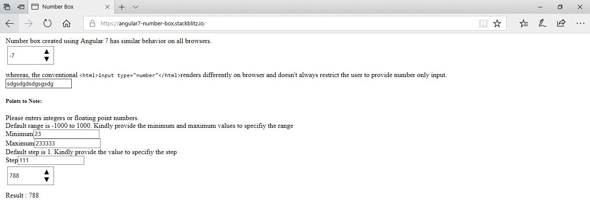
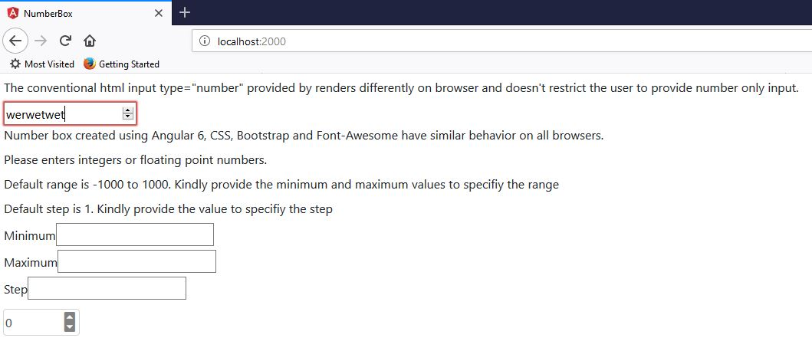
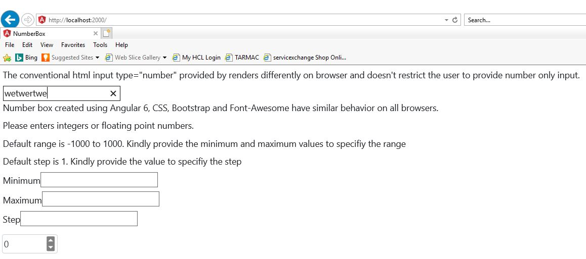
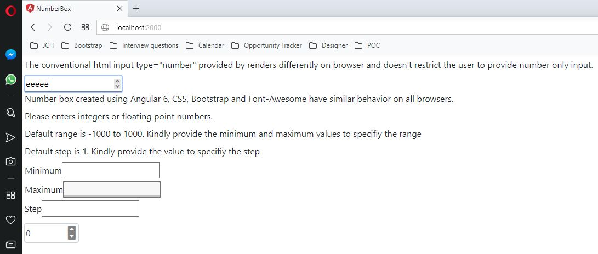

# NumberBox

Number Box created using Angular 7 to provide consistent behavior across multiple browsers in comparison to the input type="number" provided by native HTML which may or may not restrict the use to enter only numbers.
As of now, it supports only integers for step, minimum and maximum values through only number directives. However, the end user can customize it to include decimal values as well.









## Demo

Checkout the demo on StackBlitz - https://angular7-number-box.stackblitz.io/ 

## Adding the component in your project

### Add Component and Directives in module
Import
`
import { NumberBoxComponent } from './components/number-box/number-box.component';
import { OnlyNumberDirective } from './directives/only-number.directive';
`

Declaration
`
declarations: [
    NumberBoxComponent,
    OnlyNumberDirective
  ]
`

### Add selector in HTML
```
<app-number-box [min]="min" [max]="max" [step]="step" (onValueChange)="onValueChange($event)"></app-number-box>
```
### Selector Properties
Property `min`, `max` and `step` accept numeric values.

### number-box.component.ts
``` typescript
import { Component, OnInit, Input, Output, EventEmitter } from '@angular/core';


@Component({
  selector: 'app-number-box',
  templateUrl: './number-box.component.html',
  styleUrls: ['./number-box.component.css']
})
export class NumberBoxComponent implements OnInit {

  @Input() min;
  @Input() max;
  @Input() step;

  @Output() onValueChange:EventEmitter<any> = new EventEmitter();

  public input: number;

  constructor() { }

  ngOnInit() {
    if (this.min === undefined) {
      this.min = -1000;
    }
    if (this.max === undefined) {
      this.max = 1000;
    }
    if (this.step === undefined) {
      this.step = 1;
    }
    if (this.input === undefined) {
      this.input = (parseInt(this.max, 10) + parseInt(this.min, 10)) / 2;
    }
    this.onValueChange.emit(this.input);
  }

  updateValue(value: any, flag: any, step: any) {
    value = parseInt(value, 10);
    step = parseInt(step, 10);
    this.max = parseInt(this.max, 10);
    this.min = parseInt(this.min, 10);
    if (flag) {
      value = value + step;
    } else {
      value = value - step;
    }
    value = Math.min(this.max, Math.max(this.min, value));
    this.onValueChange.emit(value);
    return value;
  }
}
```

### number-box.component.html
``` html
<div class="input-wrapper">
  <input type="text" OnlyNumber class="form-control input-box" [(ngModel)]="input">
  <span class="input-icon">
    <i (click)="input=updateValue(input,true, step)"class="up-arrow input-icon"></i>
    <i (click)="input=updateValue(input,false, step)" class="down-arrow input-icon"></i>
  </span>
</div>
```

### number-box.component.css
``` css
  .input-wrapper {
    position: relative;
    padding:2px;
    width: 100px;
    height:35px;
    margin:2px;
}

.input-icon {
    position: absolute;
    right:3%;
    bottom: 40%;
}

.input-box {
    padding: 2px;
    height:35px;
    width:100px;
}

.up-arrow {
  bottom:0;
}

.down-arrow {
  top:0;
}
.up-arrow::after {
  content: '\25B2';
}

.down-arrow::after {
  content: '\25BC';
}

```
### only-number.directive
``` typescript
import { Directive, ElementRef, HostListener, Input  } from '@angular/core';

@Directive({
  selector: '[OnlyNumber]'
})
export class OnlyNumberDirective {

 // Allow decimal numbers and negative values
 private regex: RegExp = new RegExp(/^-?[0-9]+(\.[0-9]*){0,1}$/g);
 // Allow key codes for special events. Reflect :
 // Backspace, tab, end, home
 private specialKeys: Array<string> = [ 'Backspace', 'Tab', 'End', 'Home', '-' ];

  constructor(private el: ElementRef) {
  }

  @HostListener('keydown', [ '$event' ])

  onKeyDown(event: KeyboardEvent) {

    // Allow Backspace, tab, end, and home keys
    if (this.specialKeys.indexOf(event.key) !== -1) {
      return;
    }

    const current: string = this.el.nativeElement.value;
    const next: string = current.concat(event.key);
    if (next && !String(next).match(this.regex)) {
      event.preventDefault();
    }
  }
}
```
## Author

parasmani.jain2208@gmail.com
